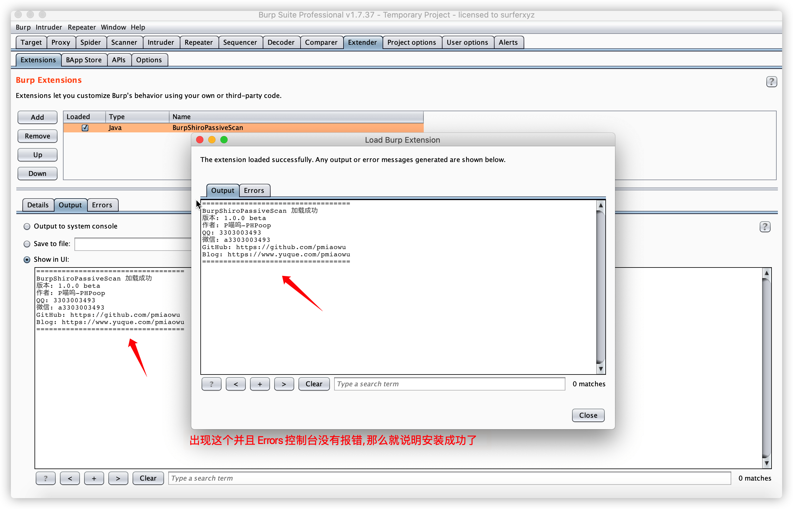

# BurpShiroPassiveScan
一款基于BurpSuite的被动式shiro检测插件

# 自言自语
据听说它的诞生是因为作者太太太懒了!

不想每个站点自己去添加个rememberMe去探测是否shiro框架

于是乎～

它就诞生了

# 简介
BurpShiroPassiveScan 一个希望能节省一些渗透时间好进行划水的扫描插件

该插件会对BurpSuite传进来的每个不同的域名+端口的流量进行一次shiro检测

目前的功能如下
- shiro框架指纹检测
- shiro加密key检测

# 安装方法
这是一个 java maven项目

如果你想自己编译的话, 那就下载本源码自己编译成 jar包 然后进行导入BurpSuite

如果不想自己编译, 那么下载该项目提供的 jar包 进行导入即可

# 检测方法选择

目前有两种方法进行 shiro框架 key的检测

1. 基于java原生jdk URLDNS 检测方法
2. l1nk3r师傅 的 基于原生shiro框架 检测方法

l1nk3r师傅的检测思路地址: https://mp.weixin.qq.com/s/do88_4Td1CSeKLmFqhGCuQ

目前这两种方法都已经实现！！！

根据我的测试 l1nk3r师傅 的更加适合用来检测“shiro key”这个功能！！！

使用 l1nk3r师傅 这个方法 对比 URLDNS 我认为有以下优点

1. 去掉了请求dnslog的时间, 提高了扫描速度, 减少了大量的额外请求
2. 避免了有的站点没有 dnslog 导致漏报
3. 生成的密文更短, 不容易被waf拦截

基于以上优点, 我决定了, 现在默认使用 l1nk3r师傅 这个方法进行 shiro key的爆破

# 修改默认shiro框架key检测的方法

有的小伙伴可能还是更喜欢dnslog的方式进行 key检测

这里提供一个方法进行修改

1. 下载本插件源码
2. 打开文件: src/burp/BurpExtender.java
3. 查找一个字符串 ShiroCipherKeyMethod2
4. 将 ShiroCipherKeyMethod2 修改为 ShiroCipherKeyMethod1
5. 重新编译

# 使用方法
例如我们正常访问网站

访问完毕以后, 插件就会自动去进行扫描

如果有结果那么插件就会在以下地方显示
- Extender
- Scanner-Issue activity

# 问题查看

# dnslog详情方法查看
如果想看插件发了什么dnslog详情可以查看这里

# shiro加密key查看

# tag界面查看漏洞情况

现在可以通过tag界面查看漏洞情况了

分别会返回

- waiting for test results = 扫描shiro key 中
- [-] not found shiro key = 没有扫描出 shiro key
- [+] found shiro key: xxxxxx = 扫描出了 shiro key

